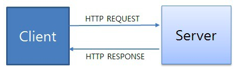

# Elements of Web Architecture

2000년대에 들어 인터넷 보급이 확산되어 집 뿐만 아니라 폰으로도 쉽게 인터넷을 접할 수 있는 시대가 도래했다. 매일 마다 우리는 인터넷을 사용하여 검색, 이메일, 동영상 시청, SNS 등을 하지만 이러한 웹 사이트를 사용 가능한게 만드는 요소들이 무엇이 있는지 알아보고자 한다.

### Browser

브라우저란 간단히 말해서 사용자들이 인터넷 망을 사용할 수 있게 끔 만들어진 소프트웨어다. 우리가 쉽게 접할 수 있는 브라우저는 크롬, 인터넷 익스플로러, 사파리, 파이어폭스 등이 있다. 

[https://w.namu.la/s/cea4ca1436370308b88738d63347348d5b1779efb874a8202f250dea24371c7fbfeb0e2497dc55727d6a3b3faee15ef4b985724943e8686aeaa4dd3a6e3b7fe68df03af83d6c866502f084c6067c45d26f32601b09e3c36999df1f287967c08b](https://w.namu.la/s/cea4ca1436370308b88738d63347348d5b1779efb874a8202f250dea24371c7fbfeb0e2497dc55727d6a3b3faee15ef4b985724943e8686aeaa4dd3a6e3b7fe68df03af83d6c866502f084c6067c45d26f32601b09e3c36999df1f287967c08b)

브라우저는 사용자가 접속하고 싶은 웹 사이트를 입력하면 브라우저는 방화벽을 통과해 서버로 부터 주소를 받아 웹 사이트에 접근하여 사용자에게 정보를 반환하는 역할을 수행한다.

### HTTP

브라우저에서 웹 사이트를 접속하기 위해 주소를 입력할 때 http가 있는 것을 보았을 것이다. http는 Hyper Text Transfer Protocol의 약자로 인터넷에서 데이터를 주고 받을 수 있는 프로토콜이다. 이는 TCP/IP 기반으로 하여 클라이언트와 서버로부터 요청과 응답을 전송한다. 모든 웹 사이트는 이 프로토콜에 맞춰 개발되어 정보 교환을 가능캐 한다.

브라우저에서 언급한 바와 같이 주소창에 웹 사이트 주소(URL)를 입력하게 되면 클라이언트는 그 웹 사이트에 대한 정보를 서버에게 요청하게 된다. 서버는 이 요청을 받고 해당 웹 사이트에 대한 정보, 즉 HTTP 메세지를 클라이언트쪽으로 보낸다.

- 요청: 클라이언트 → 서버
- 응답: 서버 → 클라이언트

### Server

서버는 어떤 임무를 수행하기 위한 컴퓨터로써 클라이언트, 즉 크롬, 파이어폭스와 같은 웹 브라우저로부터 HTTP 요청을 받아 클라이언트에게 웹 페이지를 처리하고 보내주는 일을 한다. 그래서 웹 서버는 웹 사이트를 관리와 호스팅하는 역할을 수행한다.

### API

Application Programming Interface의 약자로서 프로그램과 다른 프로그램을 연결해주는 역할을 수행하여 서로 데이터를 주고 받게끔 한다. 또한 API는 해당 프로그램의 기능을 다른 프로그램이 쓸 수 있게한다. 예를 들어 ‘페북에 공유’를 클릭하면 접속된 사이트가 페북과 통신하여 클라이언트의 페북 계정에 공유된 컨텐츠를 추가하여 클라이언트 페북 데이터를 바꿀 수 있다. 또 다른 예시는 게임을 만들고 있는데 그래픽을 구현하기 위해서 다른 사람이 만든 그래픽 프로그램을 API로서 가져와 적용하는걸 들 수 있겠다.

### AJAX

Asynchronous Javascript And Xml의 약자로서 브라우저가 갖고 있는 XMLHttpRequest 객체를 이용해서 전체 페이지를 새로 고치지 않고도 페이지의 일부만을 위한 데이터를 로드하는 기법이다.  서버 처리가 완료될 때 까지 기다리지 않고 처리가 가능하기 때문에 웹 페이지의 속도를 향상 시키고 서버에서 데이터만 전송하면 되기 때문에 전체적인 코딩의 양을 줄일 수 있다. 그러나, 연속으로 데이터를 요청할 경우 서버 부하가 증가할 수 있고 XMLHttpRequest를 통해 통신을 할 경우 사용자에게 아무런 진행 정보가 주어지지 않으므로 요청이 완료되지 않았는데 사용자가 페이지를 떠나거나 오작동할 여지가 있다.