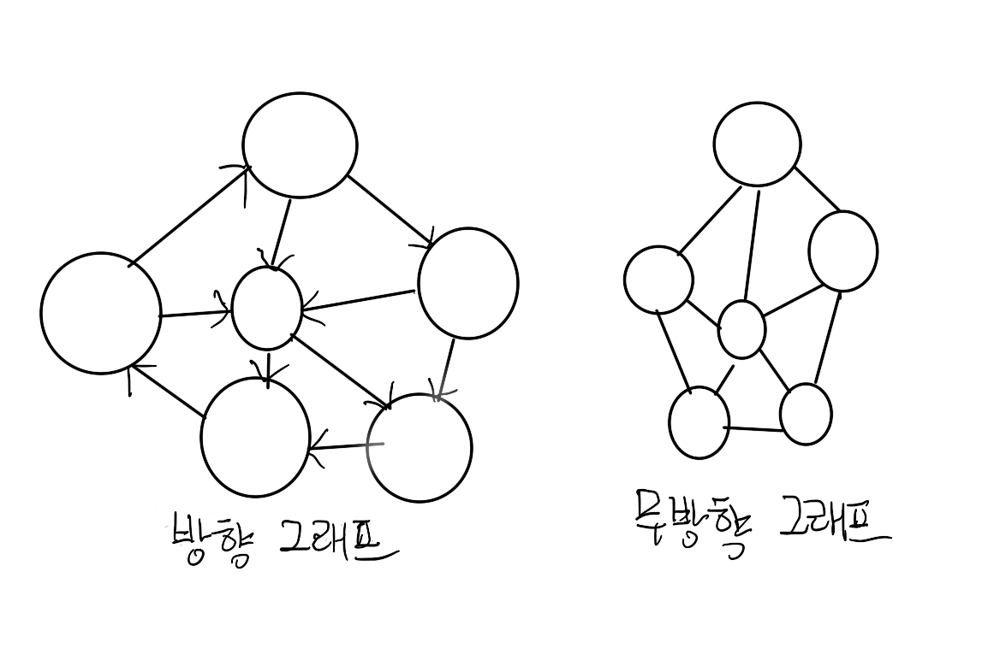
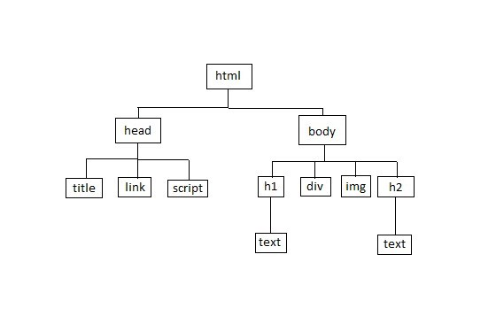
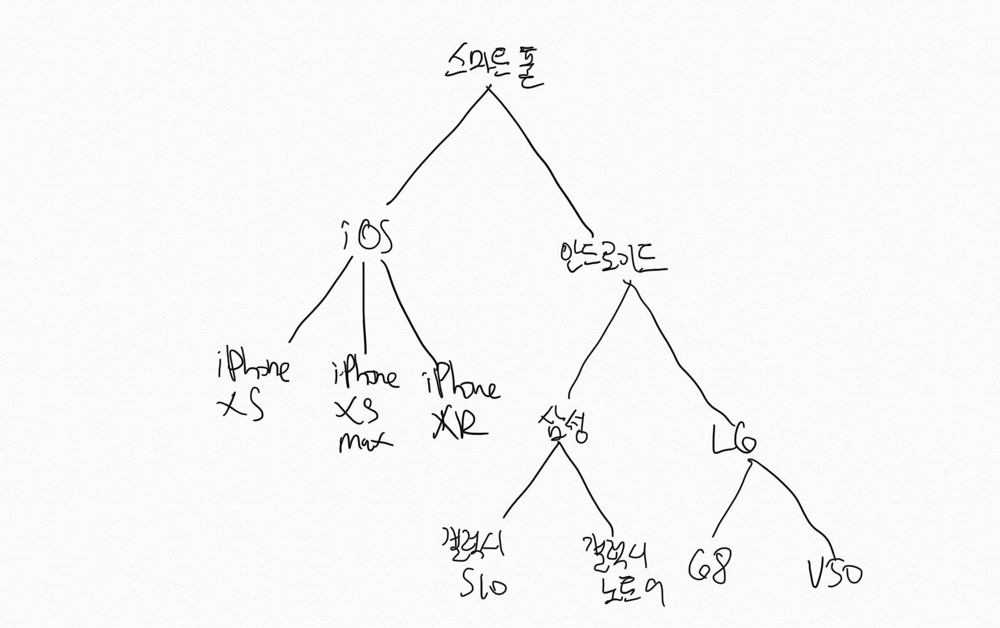
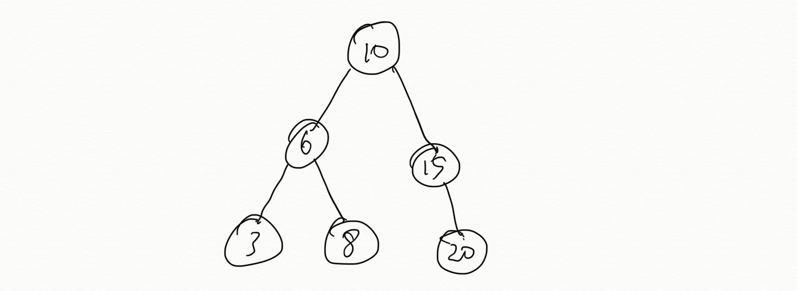
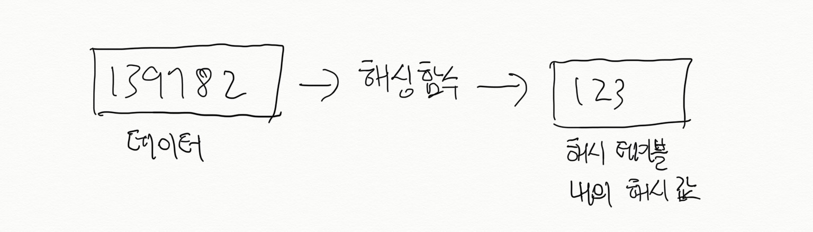
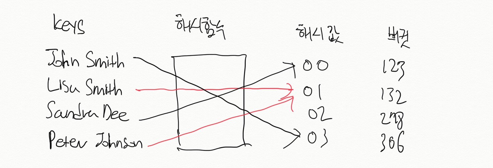

# Graph, tree, hash table, binary tree

# Graph

그래프는 데이터 간의 관계를 보여주는 구조를 지녔으며 선형 구조를 지닌 스텍, 큐와는 달리 데이터가 순차적으로 저장되지 않는다.

### 구조

그래프는 노드와 엣지로 이루어져있다.

- 노드: 데이터를 저장하고 있음.
- 엣지: 노드 간에 관계를 보여주기 위해 사용된다.
    - 방향: 노드 간 양방향이 아닌 일방적 관계를 나타냄.
    - 무방향: 노드 간 양방향 관계를 나타냄.
    - 엣지는 두 노드의 관계에 대해 길이, 거리, 무게 등과 같은 가중치를 설정할 수 있음.

    

예를 들어 SNS에서 그래프 데이터 구조가 적용될 수 있는데 인스타그램에서 사용자 A가 사용자 B를 팔로우를 시작했을 때 사용자 B 역시 사용자 A를 팔로우하면 무방향 그래프를 형성할 수 있지만 그렇지 않을 경우 방향 그래프가 형성된다.

### Pseudo code

- 그래프 객체를 선언한다. 이 객체 안에는 노드 형태를 가지고 있는 데이터와 다음과 같은 메소드들을 포함한다.
    - 두 노드들을 연결할 메소드.
    - 노드의 존재 여부를 확인하는 메소드.
    - 그래프에서 노드와 엣지를 삭제하는 메소드.
- 데이터와 엣지를 담을 노드를 생성한다.
- 노드를 다른 노드로 이어줄 엣지를 추가하기 위해 연결할 노드와 엣지의 가중치에 대한 정보를 추가한다.
- 이미 연결 된 노드에 엣지를 추가할 때를 대비하여 두 노드 간에 이미 엣지가 존재 여부를 확인하고 존재하면 가중치만 업데이트하고 존재 하지 않는 경우에는 엣지를 추가한다.
- 두 노드 간 엣지의 존재 여부를 확인하여 엣지를 없애는 기능을 추가한다.

Pseudoclassical 스타일을 따라 graph를 구현

    // Instantiate a new graph
    const Graph = function () {
      this.adjList = {}; // 데이터가 저장된 노드와 엣지를 담을 객체
    };
    
    // Add a node to the graph, passing in the node's value.
    
    Graph.prototype.addNode = function (node) {
      this.adjList[node] = []; // 노드를 빈 그래프 객체에 빈 배열 및 property로서 추가
      return this;
    };
    
    // Return a boolean value indicating if the value passed to contains is represented in the graph.
    Graph.prototype.contains = function (node) { // 그래프 객체에 찾고자 하는 노드가 있는지 확인
      for (let key in this.adjList) {             // 그래프 객체에 노드(property)들을 iterate
        if (this.adjList[key] === this.adjList[node]) { // 그래프 객체에 있는 노드(property)가 찾고자 하는 값이랑 일치하면 true를 반환
          return true;
        }
      }
      return false; // 없으면 false를 반환
    };
    
    // Removes a node from the graph.
    
    Graph.prototype.removeNode = function (node) {
      delete this.adjList[node];  // 인자로 주어진 노드(property)를 그래프 객체에서 삭제
      return this;
    };
    
    // Returns a boolean indicating whether two specified nodes are connected.  Pass in the values contained in each of the two nodes.
    Graph.prototype.hasEdge = function (fromNode, toNode) { // 두 노드 간 엣지들이 서로 연결되어 있는지 확인
      var counter = 0; // 카운터가 2이면 두 노드 간 서로 연결되어 있음
      if (!this.adjList[fromNode] || !this.adjList[toNode]) {
        return false;
      }
      for (let i = 0; i < this.adjList[toNode].length; i++) {
        if (fromNode === this.adjList[toNode][i]) {
          counter++;
        }
      }
      for (let i = 0; i < this.adjList[fromNode].length; i++) {
        if (toNode === this.adjList[fromNode][i]) {
          counter++;
        }
      }
      if (counter === 2) {
        return true;
      } else {
        return false;
      }
    };
    
    // Connects two nodes in a graph by adding an edge between them.
    
    Graph.prototype.addEdge = function (fromNode, toNode) { // 무방향 그래프이기 때문에 fromNode와 toNode를 연결해줘야 됨
      if (fromNode && toNode) {
        this.adjList[fromNode].push(toNode); // 엣지는 노드(property)인 빈 배열에 삽입
        this.adjList[toNode].push(fromNode);
      }
      for (let key in this.adjList) { // 엣지 배열에 동일한 element가 있는지 확인하고 있으면 splice로 삭제
        var temp = [];
        for (let i = 0; i < this.adjList[key].length; i++) {
          if (temp.indexOf(this.adjList[key][i]) !== -1) {
            this.adjList[key].splice(i, 1);
            temp.splice(temp.indexOf(this.adjList[key][i]), 1)
          }
          temp.push(this.adjList[key][i]);
        }
      }
      return this;
    };
    
    // Remove an edge between any two specified (by value) nodes.
    Graph.prototype.removeEdge = function (fromNode, toNode) {  // 무방향 그래프이기 때문에 fromNode와 toNode로 부터 엣지를 삭제
      for (let i = 0; i < this.adjList[toNode].length; i++) {
        if (fromNode === this.adjList[toNode][i]) {
          this.adjList[toNode].splice(i, 1);
        }
      }
      for (let i = 0; i < this.adjList[fromNode].length; i++) {
        if (toNode === this.adjList[fromNode][i]) {
          this.adjList[fromNode].splice(i, 1);
        }
    
        return this;
      }
    };
    
    // Pass in a callback which will be executed on each node of the graph.
     Graph.prototype.forEachNode = function (cb) { // 각 노드에 callback function을 적용
        for (var key in this.adjList) {
          if (parseInt(key) !== this.adjList[key]) {
            cb(parseInt(key), this.adjList[key]);
          }
        }
      };
    
    var graph = new Graph();
      graph.addNode(1);
      graph.contains(1);
      graph.addNode(2);
      graph.removeNode(2);
      graph.contains(2);
      graph.addNode(2);
      graph.addNode(3);
      graph.addEdge(2 ,3);
      graph.hasEdge(3, 2);
      graph.hasEdge(1, 3);
      graph.addNode(4);
      graph.addNode(5);
      graph.addEdge(4, 5);
      console.log(graph); //Graph { adjList: { '1': [], '2': [ 3 ], '3': [ 2 ], '4': [ 5 ], '5': [ 4 ] } }

# Tree

트리 구조는 linked list와 유사하지만 노드 간 위계적 구조를 띄고 있다는 점에서 다르다. 즉, 노드마다 한 개의 부모 밖에 가질 수 없지만 parent 노드는 여러 개의 child 노드를 가질 수 있다.  DOM 구조나 OS에 폴더 구조가 트리 구조를 지녔다고 볼 수 있다.

즉, 트리는 위계적 구조를 표현하거나 이를 통해 알고리즘의 효율을 높이고자 할 때 사용된다.

### Pseudo code

- tree라는 클래스를 만들어 root로 설정.
- 데이터와 children를 포함한 노드 클래스를 생성하여 tree에 추가.
- 추가된 노드를 tree에서 제거할 수 있는 기능을 포함.
- 노드에 있는 값을 재귀적으로 검색할 수 있는 기능을 포함.

Pseudoclassical 스타일을 따라 tree를 구현

    const Tree = function (value) {
    	this.children = [];
    	this.value = value;
    }
    
    Tree.prototype.addChild = function (value) {
    	let branch = new Tree();
    	branch.value = value;
    	this.children.push(branch);
    }
    
    Tree.prototype.contains = function (target) {
    	if (this.value === target) {
    		return true;
    	}
    	for (let i = 0; i < this.children.length; i++) {
    		if (this.children[i].value === target) {
    			return true;
    		} else if (this.children[i].contains(target) {
    			return true;
    		}
    	}
    	return false;
    }

# Binary tree

Binary tree는 각 노드마다 두 개의 children까지만 가질 수 있는 특별한 tree이다. 노드가 두 개의 children이 있을 시, 왼쪽 child는 parent가 가지고 있는 값과 동일하거나 작아야하고 오른쪽 child는 반드시 더 큰 값을 지니고 있어야 한다. 마지막으로 각 노드는 고유의 값을 가지고 있어야 한다.

이러한 독특한 구조로 인하여 트리의 반을 건너 뛸 수 있어 찾고자 하는 값을 검색하는 속도가 더 빨라지는 장점을 지니고 있다. 그러한 장점으로 인해 검색, 게임 로직, autocomplete tasks, 그래픽 작업 등에 쓰여진다.

### Pseudo code

- 노드 클래스를 생성한다.
    - 이는 노드에 들어갈 값과 왼쪽, 오른쪽 노드를 가질 수 있음으로 먼저 null값을 설정.
- root 노드에서 시작.
- root 노드가 있는 확인하고 없을 시, 해당 노드를 root로 만든다.
- root 노드가 있다면 root에 있는 값을 새로운 값에 비교해 큰지 작은지를 확인한다.
- 새로운 값이 root 노드에 있는 값 보다 크면 오른쪽으로 옮긴다.
    - root 노드 기준으로 child가 없다면 오른쪽에 새로운 노드를 생성해 그 값을 저장.
    - 만약에 child가 있다면 새로운 값을 child가 지니고 있는 값을 비교해 왼쪽 혹은 오른쪽으로 갈지 결정.
- 새로운 값이 root 노드에 있는 값 보다 작으면 왼쪽으로 옮긴다.
    - root 노드 기준으로 child가 없다면 왼쪽에 새로운 노드를 생성해 그 값을 저장.
    - 만약에 child가 있다면 새로운 값을 child가 지니고 있는 값을 비교해 왼쪽 혹은 오른쪽으로 갈지 결정.
- 검색 기능은 먼저 root에서 찾고 아니면 왼쪽 혹은 오른쪽으로 재귀적으로 찾는다.

Pseudoclassical 스타일에 따라 binary search tree를 구현

    const BinarySearchTree = function (value) {
    	this.value = value;
    	this.left = undefined;
    	this.right = undefined;
    }
    
    BinarySearchTree.prototype.insert = function (value) {
    	let branch = new BinarySearchTree();
    	branch.value = value;
    	
    	if (this.left === undefined && branch.value < value) {
    		this.left = branch;
    	} else if (this.right === undefined && branch.value > value) {
    		this.right = brach;
    	} else if (branch.left < this.value) {
    		this.left.insert(value);
    	} else if (branch.right > this.value) {
    		this.right.insert(value);
    	}
    }
    
    BinarySearchTree.prototype.contains = function (value) {
    	if (this.value === value) {
    		return true;
    	} else if (value < this.value && this.left !== undefined) {
    		if (this.left.contains(value)) {
    			return true;
    		} else {
    			return false;
    		}
    	} else if (value > this.value && this.right !== undefined) {
    		if (this.right.contains(value)) {
    			return true;
    		} else {
    			return false;
    		}
    	} else {
    		return false;
    	}
    }
    
    BinarySearchTree.prototype.depthFirstLog = function (callback) {
    	function getValues (branch) {
    		if (branch.value) {
    			callback(branch.value) {
    				if (branch.left) {
    					getValues(branch.left)
    				}
    				if (branch.right) {
    					getValues(branch.right)
    				}
    			}
    		}
    		getValues(this);
    }

# Hash table

해시 테이블은 key와 value로 데이터를 저장하는 데이터 구조이다. 해시 테이블은 원하는 데이터를 바로 찾을 수 있는 장점이 있는데 이는 각각의 객체가 지니고 있는 주소값을 해싱하여 똑같은 값을 얻어 찾고자하는 key로 value 접근이 가능하기 때문이다. 그리고 적은 리소스로 많은 데이터를 효율적으로 관리가 가능하다. 이는 사용자들의 비밀번호 등을 암호화 할 때 사용된다.

해시란 입력 받은 데이터를 완전히 다른 형태의 데이터로 바꾸는 작업이다. 이 작업을 실행하기 위해서 해시 함수를 쓰는데 이의 목적은 데이터를 가공하여 해시 테이블 내의 해시 값으로 저장하는 것이다. 인덱스에 해싱 함수로부터 얻은 해시 값을 사용함으로써 모든 데이터를 살필 필요가 없이 검색, 삽입 및 삭제를 빠르게 수행할 수 있다.

해시 함수를 통하여 얻은 해시 값을 인덱스 혹은 주소로 삼아 데이터의 value를 key와 함께 저장하여 해시 테이블를 생성이 가능하고 데이터가 저장되는 곳을 버킷 또는 슬롯이라고 불린다.

해시 함수를 통해 얻은 서로 다른 데이터가 동일한 해시값을 얻게 될 경우 해시 충돌이 일어났다고 한다.

해시 충돌의 해결책은 chaining과 open addressing이 존재한다. Chaining은 중복된 주소를 지닌 데이터들을 linked list로 줄줄이 연결하여 해시 테이블을 확장할 필요없이 삭제 작업을 가능하게 한다. Open addressing 경우는 linear probing, quadratic probing, double hashing probe 등 3 가지 방식이 존재하고 해시 테이블에 바로 데이터를 저장한다.

### Pseudo code

- 해시 테이블 클래스를 생성하여 안에 key-value 페어를 삽입할 빈 배열을 생성
- 데이터를 해시 값으로 가공할 해시 함수 함수를 만든다.
- 해시 함수를 통해 얻은 해시 값을 이용해 key-value 페어를 만들고 해시 테이블에 생성 했던 빈 배열에 삽입한다.
- key를 이용하여 찾고자하는 value을 반환하는 함수를 만든다.
- 충돌할 경우를 대비하여 데이터를 없애는 함수를 만든다.

    // hashTableHelpers
    
    const LimitedArray = function(limit) {
    
      const limitedArray = {}; // storage를 담을 객체
    
      limitedArray.storage = Array (limit); // storage 크기를 limit에 제한
      limitedArray.get = function(index) { // hash table에서 인자로 주어진 index에 있는 값을 반환
        checkLimit(index);
        return limitedArray.storage[index];
      };
      limitedArray.set = function(index, value) { // 인자로 주어진 index에 value를 저장
        checkLimit(index);
        limitedArray.storage[index] = value; // limitedArray 객체에 있는 storage의 index에 value를 저장
      };
      limitedArray.each = function(callback) {
        for (let i = 0; i < storage.length; i++) {
          callback(storage[i], i, storage);
        }
      };
    
      var checkLimit = function(index) { // storage가 꽉 찼는지 확인하는 함수
        if (typeof index !== "number") {
          throw new Error("setter requires a numeric index for its first argument");
        }
        if (limit <= index) {
          throw new Error("Error trying to access an over-the-limit index");
        }
      };
    
      return limitedArray;
    };
    
    
    // This is a "hashing function". You don't need to worry about it, just use it
    // to turn any string into an integer that is well-distributed between the
    // numbers 0 and `max`
    const getIndexBelowMaxForKey = function(str, max) { // 해싱 함수
      let hash = 0;
      for (let i = 0; i < str.length; i++) {
        hash = (hash << 5) + hash + str.charCodeAt(i);
        hash &= hash; // Convert to 32bit integer
        
        hash = Math.abs(hash);
      }
      return hash % max;
    };
    
    // hashTable
    
    const HashTable = function() { // hash table의 크기와 storage를 설정
      this._limit = 5;
      this._storage = LimitedArray(this._limit);
    };
    
    HashTable.prototype.insert = function (k, v) { // index는 해싱 함수를 이용해 구하고 v값을 storage에 저장
      // k --> key, v --> value
      const index = getIndexBelowMaxForKey(k, this._limit);
      this._storage.set(index, v);
    };
    
    
    HashTable.prototype.retrieve = function(k) { // storage로부터 찾는 k 값을 반환
      const index = getIndexBelowMaxForKey(k, this._limit);
      if (this._storage.get(index)) {
        return this._storage.storage[index];
      } else {
        console.log('Not found');
      }
    };
    
    HashTable.prototype.remove = function (k) { // 인자로 주어진 k를 받아 storage에서 k와 일치하는 index를 삭제
      const index = getIndexBelowMaxForKey(k, this._limit);
      this._storage.set(index, undefined);
    };
    
    var hashTable = new HashTable();
    hashTable.insert("a", 1);
    hashTable.insert("b", 2);
    hashTable.insert("c", 3);
    hashTable.insert("d", 4);
    hashTable.insert("e", 5);
    console.log(hashTable); 
    // HashTable {
    //   _limit: 5,
    //   _storage:
    //    { storage: [ 4, 5, 1, 2, 3 ],
    //      get: [Function],
    //      set: [Function],
    //      each: [Function] } }
    hashTable.retrieve("a"); // 1
    hashTable.remove("a");
    hashTable.retrieve("a"); // 'Not found'
    console.log(hashTable);
    // HashTable {
    //   _limit: 5,
    //   _storage:
    //    { storage: [ 4, 5, undefined, 2, 3 ],
    //      get: [Function],
    //      set: [Function],
    //     each: [Function] } }