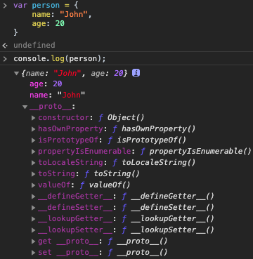
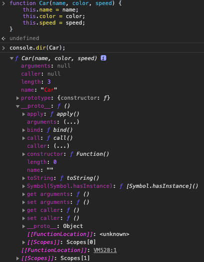

# Prototype

# 프로토타입 객체

자바스크립트는 자바와 C++와 같은 클래스 기반 객체 지향 프로그래밍 언어와 달리 프로토타입 기반 객체 지향 프로그래밍 언어이다. 그러므로 자바스크립트에서는 클래스 없이 객체를 생성할 수 있는 특징을 지니고 있다.

자바스크립트의 모든 객체는 자신의 부모 역할을 담당하는 객체와 연결되어 있으며 부모 객체의 property 또는 메소드를 참조할 수 있다. 여기서 부모 역할을 담당하는 객체가 프로토타입이라 불린다.

    var person = {
    	name: "John",
    	age: 20
    }
    console.log(person.__proto__ === Object.prototype) // true

위와 같이 person이란 객체를 선언하고 이는 부모 객체인 Object.prototype을 가리킨다.

[[Prototype]]은 모든 객체가 지닌 internal slot이며 상속을 위해 사용된다.

    function Car(name, color, year) {
    	this.name = name;
    	this.color = color;
    	this.year = year;
    }
    console.log(Car.__proto__ === Function.prototype) // true

함수 객체는 특별하게 prototype property 지니고 있다. 함수를 사용하여 객체를  선언하면 이 함수를 통해 생성될 객체의 부모 역할을 하는 프로토타입 객체를 가리킨다.

프로토타입 객체는 자신을 생성한 객체를 가리키는 constructor property를 지니고 있다.

    function Car(name, color, speed) {
    	this.name = name;
    	this.color = color;
    	this.speed = speed;
    }
    var bmw = new Car('BMW', 'black', 2019);
    
    console.log(Car.prototype.constructor === Car); // true
    // Car() 생성자 함수에 의해 생성된 객체를 생성한 객체를 Car() 생성자 함수
    console.log(bmw.constructor === Car); // true
    // bwm 객체를 생성한 객체는 Car() 생성자 함수
    console.log(Car.constructor === Function); // true
    // Car() 생성자 함수는 Function() 생성자 함수이다

프로토타입 체인은 어떤 특정 객체의 property나 메소드를 접근하려는데 없다면 [[Prototype]]이 가리키는 참조를 따라 자신의 부모 객체 역할하는 프로토타입 객체의 property나 메소드를 찾는 것이다.

person이라는 객체를 살펴보면 name과 age property 밖에 없지만 [[Prototype]] / __proto__(함수)는 person의 Object.prototype을 가리킴으로 Object.prototype이 사용할 수 있는 메소드를 지니고 있다. __proto__라는 속성으로 인하여 부모 객체로부터 새로운 객체를 만들고 만들어진 객체 안에 부모 객체의 프로퍼티나 메소드를 따로 선언을 하지 않아도 다 존재한다. 그러나, 객체의 property에 값을 할당하게 되면 프로토타입 체인이 더 이상 작동하지 않는다.

Car이라는 함수로 객체를 생성하여 console.dir를 찍어보면 함수에서 쓰이는 메소드를 사용할 수 있는 것을 확인할 수 있다.

프로토타입 객체도 객체임으로 property를 추가 혹은 삭제할 수 있다. 만일 부모 객체에 변경사항이 있을 시 프로토타입 체인에 의하여 부모 객체를 가리키는 프로토타입 객체에도 적용이 된다.

    function Car(name, color, speed) {
    	this.name = name;
    	this.color = color;
    	this.speed = speed;
    }
    var bmw = new Car('BMW', 'black', 0);
    
    Car.prototype.drive = function() {
    	this.speed += 10;
    	return this.speed;
    }
    
    bwm.drive();  // 10

객체가 생성되면 프로토타입이 결정되지만 결정된 프로토타입 객체는 다른 임의의 객체로도 변경이 가능하다.

    function Phone(name) {
    	this.name = name;
    }
    var iPhone = new Phone('iPhone');
    
    // 프로토타입 객체 변경 시점 이전에 생성된 객체
    
    Phone.prototype = { model: 'Galaxy S10'};
    
    var galaxy = new Phone('Pixel');
    
    // 프로토타입 객체 변경 시점 이후에 생성된 객체.
    
    console.log(iPhone.model); // undefined
    console.log(galaxy.model); // 'Galaxy S10'
    
    console.log(iPhone.constructor); // Phone(name) 기존 프로토타입에 바인딩
    console.log(galaxy.constructor); // Object() 변경된 프로토타입에 바인딩