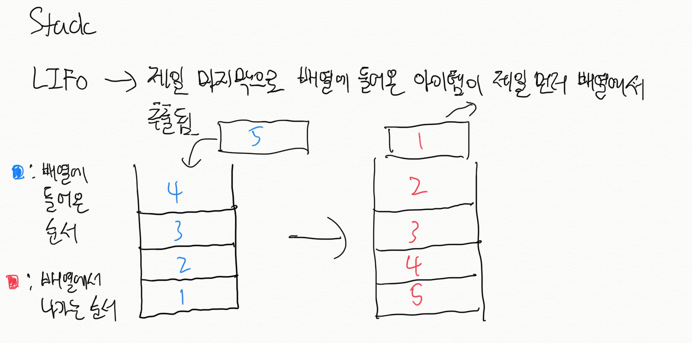
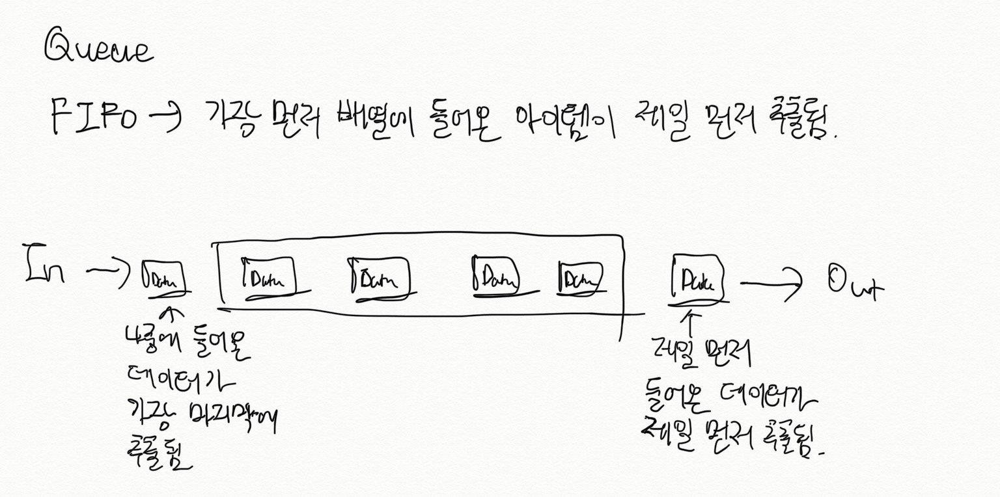
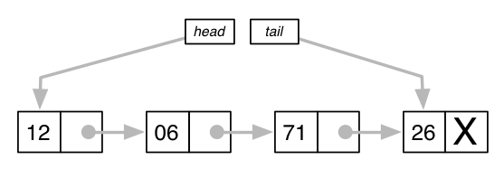
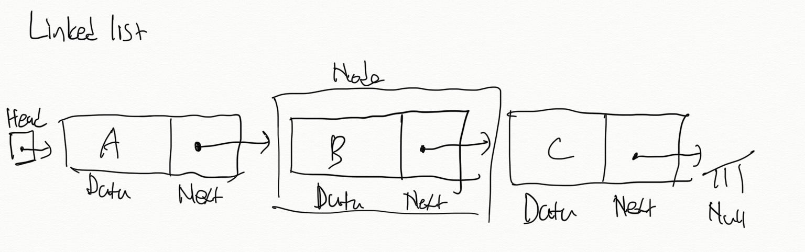
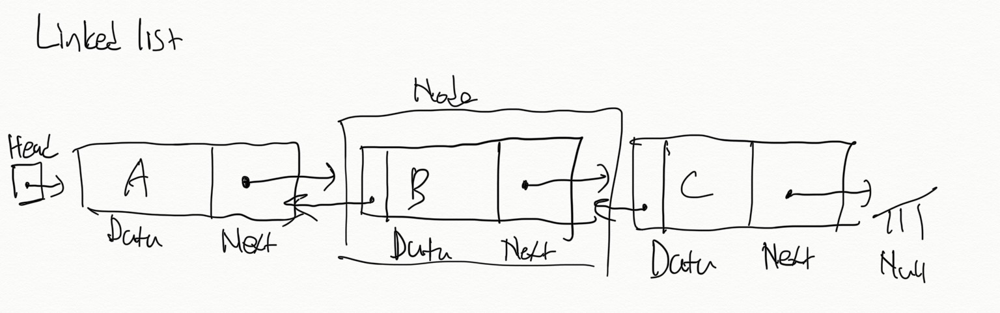
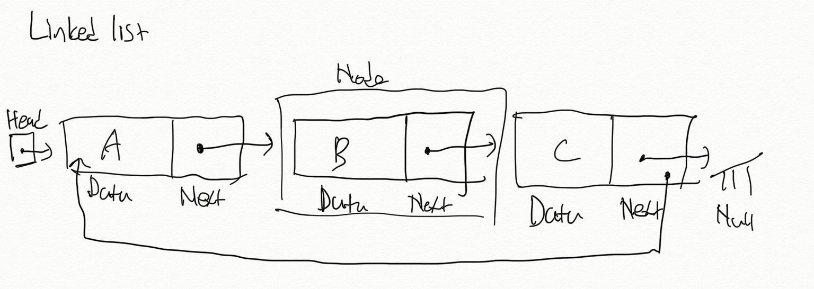
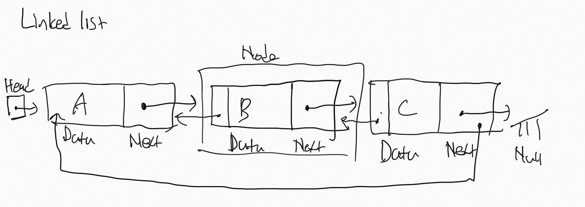
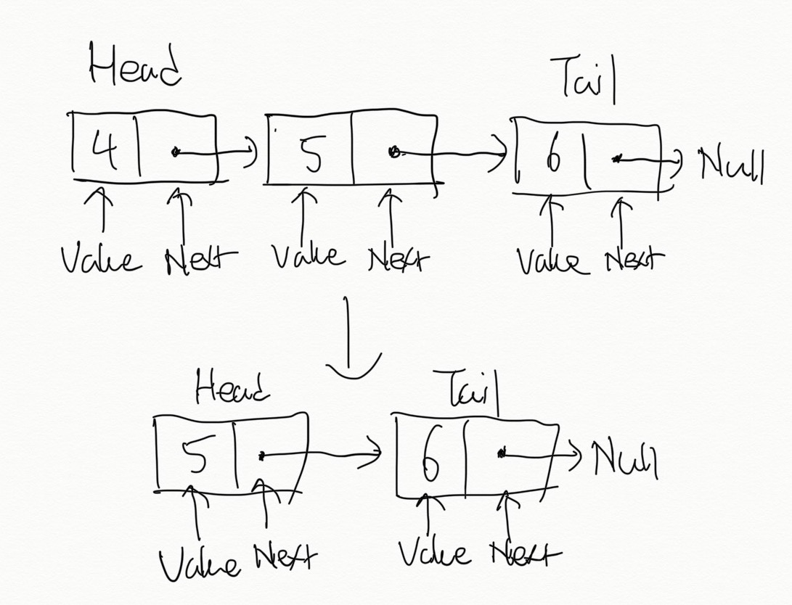

# Stack, queue, linked list

# **Stack**

Stack이란 데이터를 집어넣을 수 있는 선형 자료형이다.

LIFO (Last In First Out)라는 특징을 지녔는데 자료형에 마지막으로 들어온 데이터가 먼저 추출된다는 뜻을 지님.

데이터를 집어넣을 때 push, 데이터를 추출할 때 pop, 마지막에 넣은 데이터를 확인하는 peek 등의 작업을 수행할 수 있음.

Stack은 서로 관계가 있는 작업을 연달아 수행하면서 이전의 작업 내용을 저장해 둘 필요가 있을 때 널리 사용됨. 예를 들어  브라우저에서 '뒤로 가기' 기능이 stack을 사용한다고 볼 수 있다. '뒤로 가기' 버튼을 누를 시 바로 그 직전에 방문했던 사이트로 되돌아 가기 때문이다.

위에 사진에서 볼 수 있듯이 [facebook.com](http://facebook.com)이 stack에 facebook이 저장 되는 것을 볼 수 있고 LIFO 패턴을 따라 '뒤로 가기' 버튼을 누르게 되면 stack에서 facebook이 나오게 되어 facebook.com으로 돌아가게 된다.

또한 자바스크립트에서 stack은 call stack에서 사용된다. Call stack은 함수를 실행할 때마다 함수의 스코프를 push한다.

### Method

push(value) → Stack에 저장할 데이터를 삽입.

pop() → Stack에서 데이터를 추출. 마지막으로 들어온 데이터를 먼저 추출해야 되기 때문에 이 method가 사용됨.

size()  → Stack의 크기를 반환.

### Pseudo code

- 빈 배열을 생성한다.
- 데이터를 차례대로 빈 배열에 삽입한다.
    - 먼저 배열이 꽉 차있는지 확인.
    - 만일 배열이 꽉 차있지 않으면 마지막 데이터가 들어간 다음 위치에 들어간다.
- 데이터를 넣은 순서의 반대로 배열에서 추출한다.
    - 먼저 배열이 비어있는지 확인.
    - 만일 배열이 비어있지 않다면 맨 마지막에 넣은 데이터를 제일 먼저 추출하여 넣은 순서의 반대로 데이터를 배열에서 빼고 삭제.

Pseudoclassical 스타일을 따라 stack을 구현

    const Stack = function() {
      this.count = 0; // Stack의 크기
      this.storage = {}; // 데이터를 저장할 객체
    };
    
    Stack.prototype.push = function(value) {
      this.storage[this.count] = value; // key-value 형식으로 stack에 데이터를 삽입
      this.count++; // 데이터가 삽입될 때마다 크기와 인덱스가 1씩 증가
    }
    
    Stack.prototype.pop = function() {
      if (this.count > 0) { // Stack가 비어있는지 확인 후 마지막으로 들어온 데이터를 추출
        this.count--; // 가장 최신 인덱스 접근 및 크기를 1 감소
        let output = this.storage[this.count];
        delete this.storage[this.count]; // 마지막 데이터를 storage에서 삭제
        return output; // 빠진 데이터 값을 반환
      }
    }
    
    Stack.prototype.size = function() {
      return this.count; // 크기 반환
    }
    
    var stack = new Stack();
    stack.push("a");
    stack.push("b");
    stack.push("c");
    console.log(stack); // Stack { seq: 3, count: 3, storage: { '0': 'a', '1': 'b', '2': 'c' } }
    stack.pop(); // 'c'
    console.log(stack); // Stack { seq: 2, count: 2, storage: { '0': 'a', '1': 'b' } }

# **Queue**

Queue는 stack과 마찬가지로 데이터를 집어넣을 수 있는 선형 자료형이다.

그러나 LIFO 성질을 지닌 stack과는 달리 FIFO (First In First Out) 성질을 갖고 있어 가장 먼저 들어간 데이터가 가장 먼저 추출됨.

데이터를 집어넣는 enqueue, 데이터를 추출하는 dequeue 작업을 수행할 수 있음.

Queue는 순서대로 처리해야 하는 작업을 임시로 저장해두는 버퍼로서 많이 사용됨. 그리고 온라인 게임에서 매칭될 때도 사용되는데 먼저 메칭을 누른 사람들이 먼저 배정되기 때문이다.

### Method

enqueue(value) → Queue에 데이터를 추가

dequeue() → Queue에 데이터를 추출

size() → Queue의 크기를 확인

### Pseudo code

- 빈 배열을 생성.
- 데이터를 차례대로 빈 배열에 삽입한다.
    - Queue가 꽉 차있는지 확인.
    - Queue가 꽉 차있지 않다면 데이터를 삽입.
- 데이터를 넣은 순서대로 배열에서 추출한다.
    - Queue가 비어있는지 확인.
    - Queue가 비어있지 않다면 먼저 들어온 데이터부터 차례대로 추출하고 삭제.

    Pseudoclassical 스타일을 따라 stack을 구현

        const Queue = function() {
          this.seq = 0; // 인덱스
          this.count = 0; // Queue의 크기
          this.storage = {}; // 데이터를 저장할 객체
        };
        
        Queue.prototype.enqueue = function (value) {
          this.storage[this.seq] = value; // key-value 형식으로 queue에 데이터를 삽입
          this.seq++; // 다음 데이터 삽입을 위한 인덱스 1씩 증가
          this.count++; // 데이터가 삽입될 때마다 크기가 1씩 증가
        }
        
        Queue.prototype.dequeue = function () {
          if (this.count > 0){ // Queue가 비어있는지 확인 후 처음 들어온 데이터를 추출
            let temp = Object.keys(this.storage).sort((a, b)=> {
              if (a > b){
                return 1;
              }
              if (a < b){
                return -1;
              }
            }); // 먼저 들어온 데이터 제일 앞으로 오도록 정렬
            let output = this.storage[temp[0]];
            for (let key in this.storage){
              if(this.storage[key] === this.storage[temp[0]]){
                delete this.storage[key];
              }
            } // 처음으로 들어온 데이터를 삭제
            this.count--; // 데이터가 빠졌음으로 크기가 1 감소
        	  return output; // 빠진 데이터 값을 반환
          }
        }
        Queue.prototype.size = function () {
          return this.count;
        };
        
        let queue = new Queue();
        queue.enqueue('a');
        queue.enqueue('b');
        queue.enqueue('c');
        console.log(queue); // Queue { seq: 3, count: 3, storage: { '0': 'a', '1': 'b', '2': 'c' } }
        queue.dequeue(); // 'a'
        console.log(queue); // Queue { seq: 3, count: 2, storage: { '1': 'b', '2': 'c' } }

# **Linked list**

Linked list는 stack과 queue와 달리 선형 자료형이 아닌 비선형 자료형으로 노드의 연결로 구현된 리스트이다.

각 노드는 데이터와 포인터(next)를 가지고 한 줄로 연결되는 방식으로 데이터를 저장하여 linked list를 구현.

포인터인 next는 다음이나 이전의 노드와의 연결을 담당함.

리스트가 커질수록 더 많은 양의 메모리를 할당 받게 되고 배열과는 달리 메모리의 한 장소에만 저장해두는 것 뿐만 아니라 다른 장소에도 할당이 가능. 그러므로 linked list는 동적인 데이터 구조를 지니고 있음. 위에서 언급한 바와 같이 linked list는 여러 노드들로 구성된 구조를 지녔고 노드를 자유롭게 추가하고 삭제를 할 수 있음으로 크기를 변경할 수 있음.

배열과는 달리 데이터 구조를 변경할 필요없이 노드를 삽입 및 삭제할 수 있음.

Linked list의 예시로써 음악 플레이어를 들 수 있는데 여러 노래를 플레이리스트에 추가할 때 노래들은 서로 연결된 형태로써 재생된다. 또한 사용자는 자유롭게 플레이리스트에 노래를 추가 및 삭제도 할 수 있다.

### 구조

- Head: Linked list의 시작점으로써 linked list의 유일한 진입 포인트이다.
- Tail: Linked list의 끝.
- 노드: 실제 정보를 담고 있는 단위
    - 데이터
    - 포인터: 다음 노드의 데이터 값을 가리킴.

### 종류

- 단일 연결 리스트: 각 노드에 자료 공간과 한 개의 포인터가 있고, 각 노드의 포인터는 다음 노드를 가리킴.

- 이중 연결 리스트: 단일 연결 리스트와 흡사하나 각 노드에 두 개의 포인터 공간이 있고 각각의 포인터는 앞, 뒤 노드를 가리킨다.

- 원형 연결 리스트: 단일 연결 리스트에 처음 노드와 마지막 노드를 연결시켜 원형으로 만든 구조.

- 이중 원형 연결 리스트: 이중 연결 리스트에 있는 처음 노드와 마지막 노드를 연결시켜 원형으로 만든 구조.

### Method

addToTail(value) → 새로운 노드를 테일에 추가

removeHead() → 헤드를 제거

contains(target) → 리스트가 target 값을 갖고있는지 확인

### Pseudo code

- 데이터와 next를 담을 노드를 생성.
- Head를 생성하는데 연결 리스트가 생성될 시 노드가 존재하지 않음으로 head는 null를 가리킴.
- 데이터를 리스트 맨 끝에 추가.
    - 리스트가 비어있다면 → head가 null를 가리키고 head가 새로 생성된 노드를 가리키게 함.
    - 리스트가 비어있지 않다면 → 현재 노드 다음에 노드를 추가.
- 데이터를 리스트에서 삭제
    - 삭제하려는 데이터의 위치를 먼저 파악.

    const LinkedList = function () {
      const list = {};
      list.head = Node(); // 헤드
      list.tail = Node(); // 테일
    	
      
      list.addToTail = function (value) {
        var newNode = Node(value);
        if (!list.head.value) {
          list.head = newNode; // 헤드에 값이 없으면 새 노드가 헤드가 됨
        }
        list.tail.next = newNode; 
        list.tail = newNode; // 추가 된 노드가 테일이 됨
      };
    
      list.removeHead = function () {
        var temp = list.head.value; // 헤드를 제거하기 전에 헤드 값을 저장
        list.head = list.head.next; // 기존 헤드의 다음 노드가 헤드가 됨
        list.tail = list.tail.next;
        return temp; // 헤드의 값을 반환
      };
      
      list.contains = function (target) {
        var node = list.head; // 헤드부터 시작
        while (node) { // 리스트를 순환
          if (node.value === target) {
            return true;
          }
        node = node.next; // target 값이 아닐 시 다음 노드로 이동
        }
        return false;
        
      }
      return list;
    }
    
    
    const Node = function (value) {
      const node = {};
    
      node.value = value;
      node.next = null;
    
      return node;
    };
    
    var list = LinkedList();
    list.addToTail(4);
    list.addToTail(5);
    list.addToTail(6);
    console.log(list); // { head: { value: 4, next: { value: 5, next: [Object] } },
    									 //	tail: { value: 6, next: null },
    list.removeHead(); // 4
    console.log(list); // { head: { value: 5, next: { value: 6, next: null } },
                       // tail: null

위에 콘솔 로그에 찍힌 linked list를 그리면

